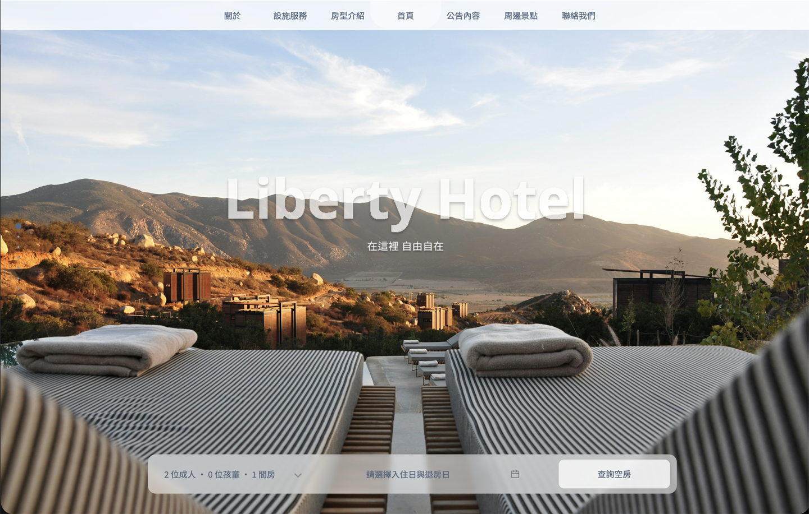

# LibertyHotel 飯店網站

---

## 💻 技術｜Tech Stack

- 🎨 前端技術｜Frontend：Vue2、pug、CSS、JavaScript
- 📝 草稿繪製｜Prototyping：Figma
- 🔄 版本管理｜Version Control：Git、GitHub
- 🤖 影像處理｜Image Processing：Adobe Photoshop

---

## 🌏 專案簡介｜Project Introduction

Liberty Hotel 飯店網站致力於打造現代化的線上訂房與飯店資訊平台，讓使用者能夠輕鬆瀏覽飯店設施、房型介紹、周邊景點與最新公告內容，並能快速查詢空房與預訂房間。設計強調使用者體驗與視覺美感，結合多種技術打造高效且易用的網站介面。

*Liberty Hotel's website aims to provide a modern online platform for room booking and hotel information. Users can easily browse hotel facilities, room types, nearby attractions, and the latest announcements, as well as quickly check availability and book rooms. The design emphasizes user experience and visual aesthetics, leveraging multiple technologies to deliver an efficient and user-friendly interface.*

---

## 🚩 特色亮點｜Key Features

- 房型介紹 Room Types
- 設施服務 Facilities & Services
- 空房查詢 Booking & Availability
- 最新公告 News & Announcements
- 周邊景點 Nearby Attractions
- 關於飯店 About

---

網站首頁以壯麗山景為背景，搭配簡潔的操作介面，讓使用者能直覺選擇入住人數、房間數與日期，快速查詢空房。上方選單涵蓋所有主要功能，方便瀏覽各項飯店資訊。

---